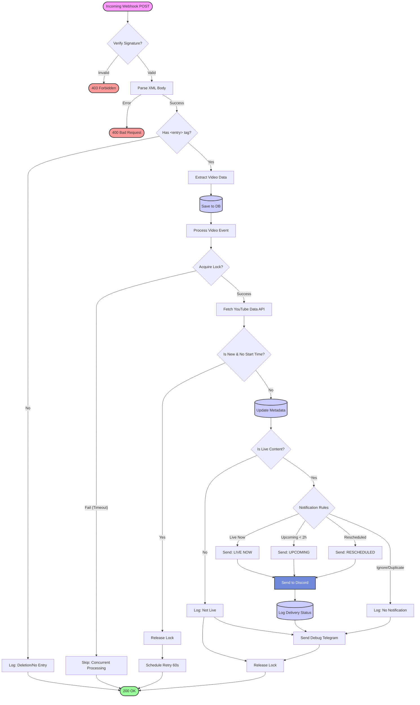

# Notification Logic Flow

This document describes the logic flow for processing YouTube notifications, from the incoming Webhook request to the final Discord notification.

## Notification Process Diagram

## detailed Steps

1.  **Webhook Verification**:
    *   The server receives a `POST` request at `/webhook`.
    *   It verifies the `X-Hub-Signature` header against the stored `SECRET_KEY`.
    *   If invalid, returns `403 Forbidden`.

2.  **XML Parsing**:
    *   The request body (XML) is parsed to extract video details (`video_id`, `title`, `published`, `link`).
    *   If the `<entry>` tag is missing, it's treated as a deletion event and ignored.

3.  **Database Persistence**:
    *   The raw notification is saved to the `notification_events` table.
    *   The `videos` table is updated or created.
    *   The system determines if this is a "new" video or an update.

4.  **Concurrency Control**:
    *   A lock is acquired for the specific `video_id`.
    *   If the lock cannot be acquired (e.g., another request for the same video is processing), the request is skipped to prevent race conditions.

5.  **Metadata Fetch & Retry**:
    *   The system queries the **YouTube Data API** for full details (`liveStreamingDetails`, `snippet`).
    *   **Retry Logic**: If it's a *new* video but the API doesn't have `scheduled_start_time` yet (common race condition), the system waits 60 seconds and retries.

6.  **Notification Rules**:
    *   The system evaluates if a notification should be sent based on:
        *   **Live Status**: Must be `is_live`, `is_upcoming`, or `was_live`.
        *   **Timing**: Upcoming streams are only notified if they start within **2 hours**.
        *   **History**: Checks the `delivery_tracking` table to prevent duplicate notifications.
        *   **Rescheduling**: Detects if a scheduled time has changed significantly.

7.  **Dispatch**:
    *   **Discord**: Sends a rich embed to the configured Webhook.
    *   **Logging**: Records the delivery status (`success`/`failed`) in the database.
    *   **Debug**: Sends a summary to the admin Telegram channel.
