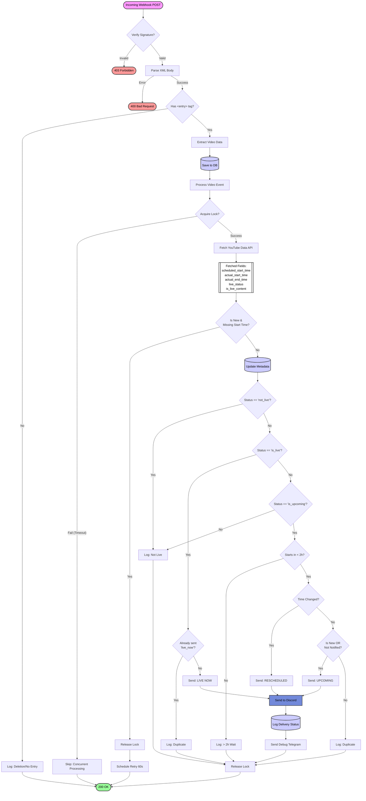

# Notification Logic Flow

This document describes the logic flow for processing YouTube notifications, from the incoming Webhook request to the final Discord notification.

## Notification Process Diagram

## Detailed Steps

1.  **Webhook Verification**:
    *   The server receives a `POST` request at `/webhook`.
    *   It verifies the `X-Hub-Signature` header against the stored `SECRET_KEY`.
    *   If invalid, returns `403 Forbidden`.

2.  **XML Parsing**:
    *   The request body (XML) is parsed to extract video details (`video_id`, `title`, `published`, `link`).
    *   If the `<entry>` tag is missing, it's treated as a deletion event and ignored.

3.  **Database Persistence**:
    *   The raw notification is saved to the `notification_events` table.
    *   The `videos` table is updated or created.
    *   The system determines if this is a "new" video or an update.

4.  **Concurrency Control**:
    *   A lock is acquired for the specific `video_id`.
    *   If the lock cannot be acquired (e.g., another request for the same video is processing), the request is skipped to prevent race conditions.

5.  **Metadata Fetch & Retry**:
    *   The system queries the **YouTube Data API** for full details.
    *   **Fields Fetched**: `scheduled_start_time`, `actual_start_time`, `actual_end_time`, `live_status`, `is_live_content`, etc.
    *   **Retry Logic**: If it's a *new* video but the API doesn't have `scheduled_start_time` yet (common race condition), the system waits 60 seconds and retries.

6.  **Notification Rules (Expanded Decision Tree)**:
    *   **Is it Live Content?** If status is `not_live`, ignore.
    *   **Is it LIVE NOW?** (`is_live`)
        *   **Already Sent?** Check DB if 'live_now' notification succeeded.
        *   **Yes** -> Ignore (Duplicate).
        *   **No** -> **Send LIVE NOW**.
    *   **Is it UPCOMING?** (`is_upcoming`)
        *   **Starts < 2 Hours?** If > 2 hours, ignore (wait for later notification).
        *   **Time Changed?** If scheduled time differs from DB -> **Send RESCHEDULED**.
        *   **Is New/Unsent?** If it's a new video OR never successfully notified -> **Send UPCOMING**.
        *   Otherwise -> Ignore (Duplicate).

7.  **Dispatch**:
    *   **Discord**: Sends a rich embed to the configured Webhook.
    *   **Logging**: Records the delivery status (`success`/`failed`) in the database.
    *   **Debug**: Sends a summary to the admin Telegram channel.
